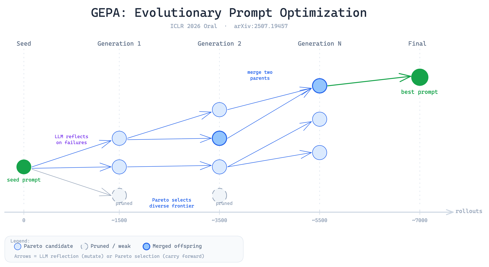
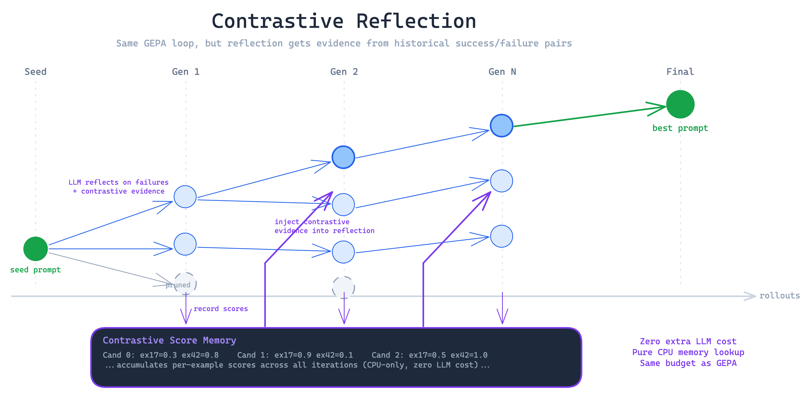
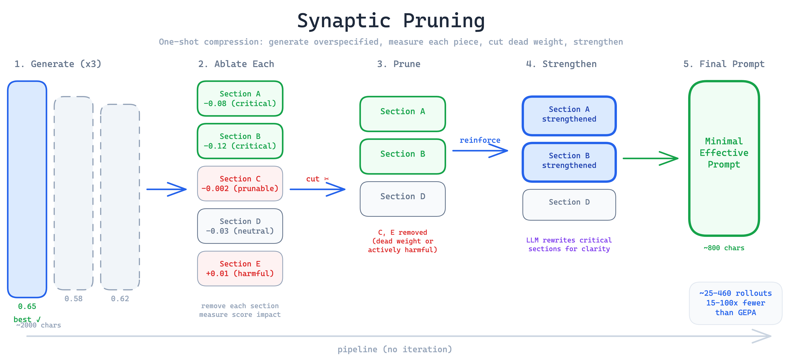
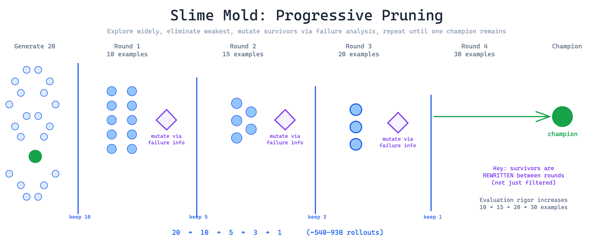
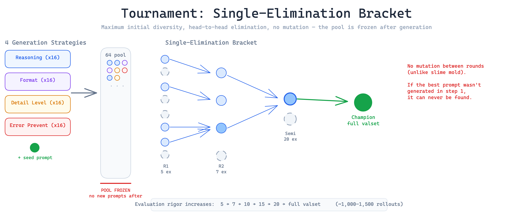

# gepa-mutations

Systematic evaluation of algorithmic mutations to [GEPA](https://arxiv.org/abs/2507.19457) (ICLR 2026 Oral) — an automatic prompt evolution framework that uses natural-language reflection and Pareto-frontier selection to iteratively improve task-specific prompts.

We test whether any of 5 mutations can definitively outperform the GEPA baseline across 3 model sizes and 6 benchmarks, using paper-faithful hyperparameters and 5-seed statistical analysis.

## Results

> *Sweep in progress — results will be populated here when complete.*

### Score Table

<!-- TODO: Fill after sweep completes -->
<!-- Format: per (model × benchmark × method) grid with aggregate + improvement vs GEPA -->

| Method | HotpotQA | IFBench | HoVer | PUPA | LiveBench | AIME | Aggregate | vs GEPA |
|--------|----------|---------|-------|------|-----------|------|-----------|---------|
| Baseline | | | | | | | | — |
| GEPA | | | | | | | | — |
| Contrastive Reflection | | | | | | | | |
| Synaptic Pruning | | | | | | | | |
| Slime Mold | | | | | | | | |
| Tournament | | | | | | | | |

### Rollout-vs-Score Curves

<!-- TODO: Add plots from plots/ directory after sweep -->
<!-- One plot per (model, benchmark), all methods overlaid, starting from seed baseline at rollout=0 -->

---

## Methods

### GEPA Baseline

The paper's 4-step iterative loop: trajectory sampling on a minibatch, natural-language reflection by the LLM, Pareto frontier selection for diversity, and system-aware merge for crossover.



### Contrastive Reflection

Augments GEPA's reflection step with mined contrastive pairs — historical examples where one candidate succeeded and another failed. Zero extra LLM cost.



### Synaptic Pruning

One-shot pipeline: generate overspecified prompts, ablate each section to measure impact, prune low-impact sections, strengthen survivors. Uses **15-100x fewer rollouts** than GEPA.



### Slime Mold

Progressive colony pruning with failure-informed mutation between rounds. Inspired by slime mold's resource allocation — paths that don't lead to food are abandoned.



### Tournament

64-candidate single-elimination bracket. Relies on initial diversity rather than iterative refinement.



---

## Quick Start

### Install

```bash
git clone --recurse-submodules https://github.com/ashwinchidambaram/gepa-mutations.git
cd gepa-mutations
pip install uv && uv sync
cp .env.example .env   # add API keys
```

### Run a single experiment

```bash
export GEPA_MODEL="Qwen/Qwen3-8B"
export GEPA_BASE_URL="http://localhost:8125/v1"

# Smoke test (5 examples, fast)
python scripts/run_all_local.py --smoke-test --workers 4 \
  --benchmark hotpotqa --method gepa --seeds 42

# Full experiment
python scripts/run_all_local.py --workers 6 \
  --benchmark hotpotqa --method gepa synaptic_pruning slime_mold \
  --seeds 42 123 456 789 1024
```

### Run baselines (no optimization)

```bash
python scripts/run_baseline.py --benchmark hotpotqa hover pupa ifbench livebench aime
```

### Validate results

```bash
python scripts/validate_sweep.py              # all models
python scripts/validate_sweep.py --model qwen3-8b  # one model
```

---

## Experimental Setup

### Models

| Model | Parameters | Quantization |
|-------|-----------|-------------|
| Qwen3-1.7B | 1.7B | bf16 |
| Qwen3-4B | 4B | bf16 |
| Qwen3-8B | 8B | bf16 |

### Benchmarks

| Benchmark | Task Type | Rollout Budget | Test Size |
|-----------|-----------|---------------|-----------|
| HotpotQA | Multi-hop QA | 6,871 | 300 |
| HoVer | Fact verification | 2,426 | 300 |
| PUPA | Privacy redaction | 3,936 | 300 |
| IFBench | Instruction following | 3,593 | 300 |
| LiveBench-Math | Math reasoning | 1,839 | ~100 |
| AIME-2025 | Competition math | 7,051 | 30 |

### Paper-Faithful Hyperparameters

All parameters match the GEPA paper (arXiv:2507.19457v2):

| Parameter | Value |
|-----------|-------|
| Temperature | 0.6 |
| top_p / top_k | 0.95 / 20 |
| Max context | 16,384 |
| Minibatch size | 3 |
| Module selector | round_robin |
| Merge | enabled, max 5 invocations |
| Candidate selection | Pareto, instance-level |
| Seeds | 42, 123, 456, 789, 1024 |

---

## Data Schema

Each experiment produces 4-5 files in `runs/{model_tag}/{benchmark}/{method}/{seed}/`:

### result.json
Primary outcomes and the optimized prompt.

| Field | Type | Description |
|-------|------|-------------|
| `test_score` | float | Held-out test accuracy |
| `val_score` | float | Best validation score during optimization |
| `train_score` | float | Score on training set (overfitting indicator) |
| `seed_prompt_test_score` | float | Baseline: un-optimized prompt on test set |
| `seed_prompt_val_score` | float | Baseline: un-optimized prompt on val set |
| `best_prompt` | dict | The optimized system prompt |
| `all_candidates` | list | Top 20 candidate prompts with scores |
| `test_example_scores` | list | Per-example test scores (for bootstrap CIs) |
| `rollout_count` | int | Total LLM evaluation calls used |
| `wall_clock_seconds` | float | Total runtime |

### metrics.json
Cost, efficiency, and trajectory data.

| Field | Type | Description |
|-------|------|-------------|
| `total_tokens` | int | Total tokens consumed (task + reflection) |
| `task_error_count` | int | LLM errors during evaluation |
| `reflection_error_count` | int | LLM errors during reflection |
| `val_score_trajectory` | list | (rollout, score) pairs — starts at rollout=0 |
| `prompt_length_trajectory` | list | (rollout, char_length) pairs |
| `prompt_char_delta` | int | Character length change from seed prompt |
| `prompt_levenshtein_ratio` | float | Edit distance ratio (0=completely different, 1=identical) |
| `val_example_scores` | list | Per-example validation scores |
| `train_example_scores` | list | Per-example training scores |
| `stage_timings` | list | Per-stage seconds + rollouts (standalone methods) |

### test_outputs.json
Raw model responses for qualitative error analysis.

```json
[
  {
    "example_id": "hotpotqa_test_0",
    "input": "What is the capital of...",
    "expected": "Paris",
    "output": "The capital of France is Paris...",
    "score": 1.0
  }
]
```

### config.json
Full hyperparameter snapshot for reproducibility, including `train_size`, `val_size`, `test_size`.

### environment.json (once per model)
Software versions (`vllm`, `torch`, `python`), GPU info, hostname.

---

## Repository Structure

```
gepa/                        GEPA submodule (v0.1.1, patched)
src/gepa_mutations/
  base.py                    MutationConfig, run_mutation() helper
  config.py                  Settings, paper defaults, model registry
  benchmarks/                Dataset loaders + evaluators (6 benchmarks)
  metrics/                   MetricsCollector, TrackedLM, token/error tracking
  runner/                    ExperimentRunner, callbacks, progress streaming
  storage/                   Atomic JSON persistence, environment metadata
  notifications/             Telegram notifier
methods/
  gepa/                      Paper baseline (ICLR 2026 Oral)
  contrastive_reflection/    Augmented reflection with contrastive pairs
  synaptic_pruning/          One-shot generate-ablate-prune pipeline
  slime_mold/                Progressive colony pruning (20→10→5→3→1)
  tournament/                64-candidate single-elimination bracket
  _experimental/             Methods in development (capo)
scripts/
  run_all_local.py           Parallel experiment orchestrator + Telegram notifications
  run_baseline.py            No-optimization baseline evaluator
  validate_sweep.py          Post-sweep result schema validation
  runpod_pod_a.sh            RunPod: 1.7B → 4B sweep (single GPU)
  runpod_pod_b.sh            RunPod: 8B sweep (single GPU)
  runpod_progress.sh         RunPod: progress dashboard
docs/                        Planning docs, known issues
runs/                        Experiment results (tracked in git)
```

---

## Infrastructure

### RunPod (Current Sweep)

Two community pods running independently:

| Pod | GPU | Model(s) | Workers |
|-----|-----|----------|---------|
| Pod A | RTX 3090 Ti (24GB) | 1.7B → 4B | 8 / 6 |
| Pod B | RTX 5000 Ada (32GB) | 8B | 4 |

Each pod pushes results to its own git branch (`runpod/pod-a`, `runpod/pod-b`), merged into master after completion.

### MLX Local (Mac Sweep)

MacBook Pro M5 Max (48GB) running small + cross-architecture models via MLX-LM. See `CLAUDE.md` for model ports and setup.

---

## Monitoring

The orchestrator sends Telegram notifications:

- **30-minute digests** with progress, ETA, cost, method scores (suppressed 2am-8am)
- **Milestone alerts** at 25%, 50%, 75% completion
- **vLLM health monitor** — background thread polls every 2 min, alerts on down/recovered
- **Stall detection** — alert if no experiment completes in 90 minutes
- **Failure alerts** — immediate on any experiment error

---

## Known Issues

See [docs/issues.md](docs/issues.md) for the full list. Key items:

- **gepa state `FileNotFoundError`** on NFS — patched in submodule
- **vLLM IPC socket path length** — `cd /tmp` before launching (all scripts do this)
- **Tournament invisible to monitoring** — no intermediate files; use `curl localhost:8125/metrics | grep num_requests_running` to confirm activity
- **AIME dspy hang** — ChainOfThought calls can hang without timeout; monitor for >4h experiments

---

## Citation

```bibtex
@inproceedings{gepa2026,
  title={GEPA: Genetic Evolution of Prompts with Adaptation},
  author={...},
  booktitle={ICLR},
  year={2026}
}
```

## License

MIT
